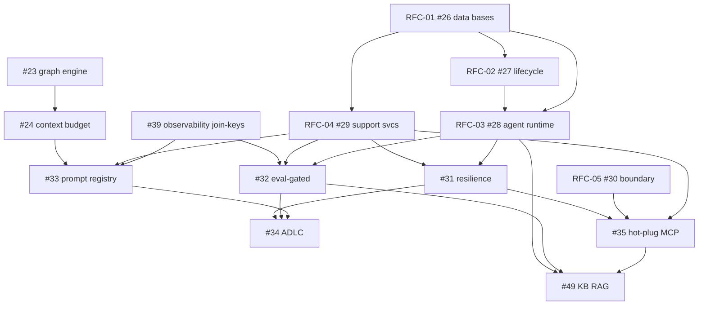

# Post-#36 Backlog -- Implementation Plan

Planning artifact for the work remaining after the #36 multi-tenant sweep
closed. Status reflects `dev` as of the v0.3.0 line. Each item is split into
what is already done, what is doable now (bounded, low risk), and what is
genuinely gated (infra, crypto re-derivation, or a design/operator decision).

Effort key: S (<1 day), M (1-3 days), L (multi-day), XL (multi-week program).

---

## Part A -- Near-term bug / security items

### #50 SECURITY: Secret exposure via config read paths and plaintext audit -- M
Done: non-admin config-read redaction (C6); `smtp_password` redacts for
non-admin readers.

Remaining:
1. **Redact secret values in config-change audit events.**
   `ConfigRegistry.set()` (`storage/registry.py:211-223`) writes an audit event
   carrying `old_value` + `new_value` in plaintext; for a secret-classed key
   (e.g. `llm_seal_hmac_key`) the secret lands in `auditeventrecord`.
   - Reuse the schema's secret classification already used by the read-redaction
     path (the field/flag that marks a key secret).
   - When the key is secret, replace both values with a redaction sentinel in
     the audit payload; keep the change-happened record.
2. **Kill the bare `ConfigRegistry()`.** `scheduled_reports.py:245-246`
   constructs `ConfigRegistry()` with no `register()` -> schema-less reads +
   a second DB session outside the request. Route it through the shared
   registered registry (mirror how other routers obtain it: app.state /
   Depends).

Risk: LOW (additive redaction + registry swap). Test: setting a secret key
produces a redacted audit row; a non-secret key stays plaintext; scheduled
reports read a schema-validated value.

### #42 SECURITY: Network / secrets / SSH tool surface -- L (mixed)
Done: SSRF re-validated on every redirect hop (`87cba5a`); SSH strict host-key
checking when `known_hosts_path` is set (RejectPolicy + fingerprint verify).

Doable-now hardening batch (LOW-MED, `services/ssh.py` + `tools/ssh.py` +
`storage/secrets.py` + `contracts/platform.py`):
1. **SSH file-op path containment** -- `upload_file`/`download_file` confine
   local paths to an allowlisted base dir; reject traversal + symlinks (stops
   `/etc/shadow` exfil and config/keyring overwrite).
2. **Command redaction in logs** -- `tools/ssh.py:24` logs the full command;
   redact known secret patterns (`PGPASSWORD=`, `Authorization:`, ...) or log
   command name + hash only. Same redaction on the timeout/error path
   (`services/ssh.py:200-209`) that embeds `command[:200]`.
3. **`forward_trusted` audit + validation** (`tools/ssh.py:48-50`) -- write an
   audit entry; decide whether the tool allowlist should still apply.
4. **`private_key_path` constraint** (`contracts/platform.py:103`) -- validate
   to an allowlisted dir; reject arbitrary filesystem paths.
5. **Windows keyring ACL** (`storage/secrets.py:157-158`) -- set a 0600-equivalent
   ACL on the keyring file on Windows so only the owner reads the master key.

MED: **DNS-rebinding pin** -- resolve the host once, connect to the pinned IP,
preserve the Host header for TLS SNI (closes the check-vs-connect TOCTOU in
`tools/http.py`).

Gated:
- **Reject-by-default host keys** (AutoAddPolicy when `known_hosts` unset) --
  OPERATOR-GATED: breaks first-connect to unconfigured lab hosts. Ship behind a
  config flag `ssh_strict_host_key_checking` (default False now) so the operator
  can flip it on per deployment.
- **HKDF salt** (`llm/encrypt.py:47`, `salt=None`) + **`rotate_all_secrets()`**
  -- RISKY crypto. Changing the salt invalidates existing derived keys; both
  need a re-derivation / re-encryption migration and operator sign-off. Plan:
  (a) add a per-key random salt stored beside the ciphertext; (b) a rotation
  command that decrypts-under-old / re-encrypts-under-new for every secret;
  (c) a one-time migration to backfill salts. Sequence AFTER a DB backup.

### #61 BUG: Contract correctness / serialization / payload hygiene -- M
Done: `RegisteredSystem` tolerates extra ORM columns; observables JSON-guarded
at construction; `upsert_many` batched; observation reads paginated + inserts
deduped + value size-capped; deterministic family match.

Remaining:
1. **#61-5 ModulePayload discriminator** (S) -- `contracts/runtime.py`
   `ModulePayload` union relies on Pydantic first-match. Add a `Literal` `kind`
   field to each member (`PlatformRegistryPayload`/`PlatformCommandPayload`) and
   `Field(discriminator="kind")` on the union; set `kind` at each producer.
   `module_payload` is response-only (not persisted) -> no data migration. Check
   the frontend types if it consumes the payload shape.
2. **#61-3 obligation enforcement** (L / design) -- `obligations.adjudicate()`
   is called only by `nday_researcher`; 5/6 modules never enforce evidence
   obligations. Two honest options: (a) add a platform post-outcome
   adjudication step in the workflow/runtime so every module enforces
   obligations; (b) scope the obligation system honestly to nday and document
   it. Recommend (a) as a non-blocking post-outcome hook; treat as its own
   design pass. RISKY only if made a blocking gate mid-workflow.

### #39 BUG: Observability and debug correlation -- L (mostly doable; one new component)
Not truly blocked -- most of it is additive. Feeds #32 (record-replay) and #33
(provenance), so land it BEFORE those RFCs.
1. **Join-key columns** (M) -- add `investigation_id`/`branch_id`/`turn_number`
   to `LLMCostRecord` (`llm/cost_record.py`) and the VR `mcp_call_log`; thread
   them at the write sites; migration. Cost + tool calls become attributable to
   a turn.
2. **Retention of the decision trail** (M) -- store the full handler output in
   `workflows/log.py:write_exited` (not a 16-char hash); retain the raw MCP body
   in `tool_executor` alongside the adapter output; config-gate full-prompt
   storage (not the 200-char preview). Columns / config, additive.
3. **Domain-event persistence** (M-L, new component) -- the 10-event catalog is
   emitted but never persisted and `correlation_id` is always empty. Build a
   domain-event store (table + a subscriber that writes each event) and populate
   `correlation_id` from the run/investigation id. This is the "event bus"
   piece -- a bounded new platform component, not a blocker.
4. **WorkflowEvent history** -- persist (to the event store) instead of stripping
   when `debug=False`.

Risk: additive columns LOW; the event store is a new component (MED). Test: a
turn is replayable end to end -- cost/tool/event rows all join on
`investigation_id`+`turn_number`.

### #45 BUG: Storage / migration / config health -- M
Done: hot-column indexes (migration 075); confidence-drift retention sweep;
tunable DB pool; SMTP config keys declared; redis-url lookup guarded.

Remaining:
1. **Declare the `llm_*` ghost config keys** (S) -- 7+ `llm_*` keys are read at
   runtime but absent from `PlatformConfigSchema`, so `ConfigRegistry.set()`
   rejects them and they only work via env. Add them to the schema.
2. **`NotificationRecord.created_at` index** (S) -- add the index (migration 077);
   `ORDER BY created_at DESC` is the primary query. (075 indexed audit/artifact
   but not notifications.)
3. **Destructive-migration guard** (S) -- `069`'s `DROP TABLE ... CASCADE` had no
   guard. Cannot rewrite a past migration; add a row-count-guard helper + a
   convention doc for FUTURE destructive DDL.
4. **#45-4 Text->JSONB** (M) -- NOT permanently blocked; it needs its 3 consumers
   reworked FIRST: `systems.py` `route_json.contains()` (SQL LIKE) and the
   `name in route_json` Python check, and `report.py`'s `json.loads(raw)` at 3
   sites. Rewrite those to JSONB operators (`@>`, `->>`) / native json access,
   THEN migrate `route_json`/`short_memory_json`/`summary_json` Text->JSONB with
   a `USING col::jsonb` cast. Sequence the consumer rewrite and the migration in
   one PR.

### #51 SECURITY: LLM-generated PoC / exploit runs without a sandbox -- L (infra-gated headline)
Doable-now bounded fixes in `modules/vr/tools/poc_runner.py` (MED, no infra):
1. **`poc_path` confinement** -- reject any `poc_path` not under `_REMOTE_DIR`.
2. **Sanitizers on C PoCs** -- compile with `-fsanitize=address,undefined`.
3. **Cleanup + quota** -- teardown `/tmp/aila_vr/` artifacts after each run;
   cap accumulation (reliability runs currently pile up binaries unbounded).

Gated headline (L + infra decision):
4. **Disposable network-isolated sandbox** -- compile + run each PoC inside a
   throwaway container/microVM (Docker / nsjail / Firecracker) with `--network
   none`, dropped capabilities, an ephemeral FS, and mandatory teardown. Gated
   on choosing + provisioning a runtime on the execution host (operator infra
   decision). Recommend nsjail or a rootless Docker sidecar for the SSH-host
   execution path. This gate is a prerequisite for any unattended / multi-tenant
   deployment.

---

## Part B -- Platform RFC program

The RFC theme: the investigation / reasoning engine exists as two drifted copies
(`modules/vr/` and `modules/malware/`), ~20,000 duplicated lines with real
malware-side bugs. The program extracts one platform implementation, then layers
new capabilities on top. Grounded phase-by-phase against current code by four
read-only scouts.

### Engine Extraction Program (#25 umbrella)

#### RFC-01 -- #26 Data-model bases + shared contracts/enums -- M (6 phases)
Foundation; every other sub-RFC depends on it. No `_base.py`/`enums.py`/`_naming.py`
exist in `platform/contracts/` today; 13 tables, 19 StrEnums, 3 contract modules
are copied VR<->malware (5 tables are pure `s/vr/malware/`).
1. Platform scaffolding -- add `_naming.py`, `enums.py`, `hypothesis.py`,
   `evidence_graph.py`, `target_stages.py`, 11 `*_base.py` record + contract
   bases. Additive, no migration. Bases inherit `storage/mixins.py:TeamScopedMixin`.
2. Module re-export shims -- VR then malware switch shared enums/contracts to
   `from aila.platform.contracts...`.
3. Zero-domain tables adopt bases (branch/outcome/outcome_review/mcp_call_log/
   investigation_target) -- migration: constraint renames.
4. Domain-carrying tables adopt bases (workspace/target/investigation/message/
   pattern/project) -- migration: constraint renames + `declared_attr` FKs; fixes
   the `uq_workspace_team_slug` / `uq_target_tag_source` collisions structurally.
5. Delete emptied module contract copies.
6. Honesty rules (`hoisted_enum_redeclared`, `unnamed_derived_constraint`,
   `shadowed_platform_base`) + `_template` update.
Risk: abstract bases must NOT set `table=True` (metadata phantom tables);
Alembic autogen produces spurious diffs on constraint renames -- write explicit
reviewed migrations. Test: `alembic upgrade head` from fresh DB; MRO field-set
assertion; `metadata.tables` diff empty after Phase 0.

#### RFC-02 -- #27 Investigation lifecycle + workflow state engine -- L (7 phases)
Depends on RFC-01. Delivers the malware bug fixes by construction: malware
`api_router.py` pause (:1655) / resume (:1682) write `record.status` directly,
never touching cursors/tasks/ARQ; re-enqueue (:1893) no stale-cancel so
`TaskQueue.submit` dedup no-ops; cost (:1964) reads `cost_actual_usd` = always $0.
VR wires these correctly and is the reference.
1. `platform/services/investigation_lifecycle.py` (pause/resume/reenqueue
   parameterized over record models + task_fn + track); VR becomes a dispatcher.
2. Migrate malware onto the service -- FIXES malware pause/resume/re-enqueue.
3. `platform/services/investigation_summaries.py` + live-cost aggregation --
   FIXES malware $0 cost gauge (reads `LLMCostRecord`).
4. Extract `spawn_persona_siblings` (~250 dup lines/module -> one call).
5. Extract setup/loop/emit factories with `InvestigationStateHooks` (VR passes
   CVE-intel hook; malware passes playbook/pattern proposer hooks, made optional).
6. Delete module `pause_resume.py` copies + shrink state files to factory stubs.
7. Honesty rules (`lifecycle_handler_bypass_service`, `cost_read_stored_actual`).
Risk: malware pause/resume behavior INTENTIONALLY changes (the fix) -- verify on
a running malware investigation. Loop factory must parameterize bridge-tool set
(VR: IDA+audit_mcp+android; malware: IDA only) and per-module researcher class.
Phases 0-1 are the highest-value; land them before 2-5.

#### RFC-03 -- #28 Platform agent runtime -- XL (7 phases)
Depends on RFC-01 + RFC-02. `platform/agents/` does not exist. Extracts the
per-turn primitives (run_turn ~395 dup lines, tool_executor, auto_steering 746
zero-drift dup lines, intent_classifier, branch_manager, claim_verifier,
outcome_dispatcher). Strictly ordered 1->7.
1. auto_steering + intent_classifier -> platform (mechanical zero-drift lift).
2. `SiblingConsensusInjector` + `IdempotentLLMCall` -- adopt at 5 idempotency
   BYPASS sites (`claim_verifier:582,677`, `nday_researcher:305`,
   `synthesis_agent:201`, `pattern_extractor:152`); fold cache-store into the
   post-LLM UoW so it commits/rolls-back together (highest-risk fix).
3. `BranchPool` -- cap via `ConfigRegistry` (retires VR `os.environ` at
   `branch_manager:73`); add `SELECT FOR UPDATE` on parent for atomic cap.
4. `ToolExecutor` -- merge VR pre-call hard-block with malware error-class
   classifier + server allowlist; both modules gain the other's guard.
5. PatternExtractor/ClaimVerifier/SynthesisRunner/PersonaRouter (8 copies -> 4).
6. `OutcomeDispatcherBase` -- fix TOCTOU (`outcome_dispatcher:215-244`) with
   `SELECT FOR UPDATE` + same-UoW `dispatch_status='claimed'`; migration if the
   enum lacks `claimed`.
7. `AgentTurnRunner` capstone -- VR gains the empty-rationale reject-to-abstain
   downgrade; modules collapse to `wiring.py`. Ship last.
Risk: turn-runner extraction can break per-module submit-gate ordering (keep
`submit_gates` an ordered module-controlled list). All VR `os.environ` reads move
to `ConfigRegistry`.

#### RFC-04 -- #29 Investigation support services -- L (4 phases)
Depends on RFC-01 only. 7 zero-delta service files (~1,832 lines) + 6
near-identical (with a real drift bug: VR `investigation_finalizers` guards
`synthesize_no_finding_outcomes` on `is_llm_recently_unhealthy(600)` at :109;
malware does NOT -> bogus no_finding rows under LLM outage).
0. Zero-delta lifts (pattern_store, stage_tracker, branch_reaper, branch_cleanup,
   arq_purge, multi_target, machine_readiness) -> platform; delete 14 module
   files. Second-highest-value PR after RFC-05 Phase 0.
1. Parameterized lifts (mcp_registry, mcp_call_logger, investigation_reaper,
   investigation_finalizers [bakes in the LLM-health guard -> closes the malware
   drift bug], stall_recovery, outcome_review [veto_k param, edit_outcome on base]).
2. `platform/config/module_config_base.py` + typed getters; delete
   `malware/services/config_helpers.py`; `vulnerability/config_schema.py` gains
   the `extra='forbid'` it was missing (may trip previously-silent typos).
3. `frontend/src/platform/hooks/useSSEStream.ts` -- VR gains sinceId catch-up +
   reconnect it lacked.
Risk: forensics `machine_readiness.py` (install cascade) stays module-side as a
subclass. Strict-validate all env configs before the Phase 2 merge.

#### RFC-05 -- #30 Boundary settlement -- L (8 phases)
NO dependencies; parallelizable from day one. Fixes 7 concrete boundary
violations. Phase 0 is the ideal FIRST PR of the whole program.
0. Mechanical imports (zero behavior) -- add `Tool` to `platform/tools/__init__`
   `__all__`; rewrite 14+ `tools._common` + 60+ `contracts._common` imports to
   public paths; canonicalize `ConfigRegistry` on `aila.storage.registry`.
1. Parameterize MCP bridges by `module_id` (retire `vr.*` tool-name welding at
   `audit_mcp:280`/`ida_headless:91`/`android_mcp:351`).
2. De-weld 9 API routers hardcoding `require('vulnerability')` -- opt-in
   `ModuleProtocol` methods + iterate registered modules; move domain endpoints
   into `vulnerability/api_router.py`.
3. Generalize platform events (Scan*/Finding* -> ModuleWorkflow*/ModuleEntityBatch*).
4. Strategy/domain-profile registries (`ReasoningStrategyFamily` Literal -> str;
   modules register their own).
5. `IntelServiceProtocol` via ServiceFactory (retire VR's
   `require_module('vulnerability')` + `getattr` at `cve_intel_resolver:178-182`).
6. Public `ProgressStream.emit` + `TaskQueue.reap_stale_tasks`/`purge_orphan_cursors`
   (retire raw SQL at `parent_reconciler:940-965`).
7. Module-contributed tracks + finding state machines (drop `TRACK_VULNERABILITY`,
   `VALID_TRANSITIONS` from `api/constants.py`/`schemas/endpoints.py`).
5 new honesty rules (`platform_names_module`, `private_platform_import`,
`raw_sql_platform_tables`, `module_prefix_in_platform_tool_name`,
`platform_owns_event_vocabulary`).

### Capability RFCs (layered on the extraction)

#### RFC-06 -- #23 Platformize the adaptive graph engine -- XL (7 phases)
Depends on nothing to start Phase 0, but Phases 2-3 SHARE the RFC-03 extraction
surface (coordinate). `DurableStateMachine` transitions are fixed strings
(`types.py:StateSpec.on_success: str|None`); VR is a 3-node linear DAG with a
hardcoded 6-persona fan-out. Phases: (1) graph primitives + callable `on_success`
+ `cycle_budget`; (2) extract panel graph to `platform/agents/` as declarative
`GraphSpec`; (3) auto-steering extraction; (4) router transitions (verifier ->
research loop-back on nday); (5) dead-branch pruning; (6) dynamic fan-out width;
(7) blackboard node replacing manual sibling_consensus injection. Risk: per-branch
cursor hierarchy (`WorkflowStateCursor` stores one state per run_id today);
cycle_budget must integrate with the LLM cost cap.

#### RFC -- #24 Budget-aware context management -- L (6 phases)
Depends on #23 Phase 2. `CyberReasoningEngine.absorb`/`render_case_model`
(`platform/services/reasoning.py`) is flat-concat with count caps (10/turn, 150
total). Phases: (1) `TokenBudgetAssembler` + 5 tiers (fast byte/tiktoken count,
never an LLM call to count); (2) budget-aware render; (3) running summary on
eviction (EXTRACTIVE -- preserve `file:line` anchors verbatim); (4) embedded
observation store + retrieved tier (migration: observation-embedding namespace);
(5) cross-branch read-only shared pool; (6) relevance-scored eviction. Highest-ROI
single phase in the whole program: Phase 1-2 fixes the turn-0 prompt-overflow
timeout class. Risk: idempotency cache must key on the REALIZED prompt.

#### RFC-07 -- #31 Self-healing resilience layer -- XL (7 phases)
Phase 0 (fail-closed flip) INDEPENDENT + high value; Phases 1-5 ride RFC-03/04.
5 fail-open sites confirmed: `queue.py:444` defer returns 0.0 on DB error;
`verify.py:233` swallows all -> disables the gate; `pipeline.py` default
fail_mode open; `investigation_finalizers` closes infra-killed branches as
'no finding'; `emitter/log` swallow. Phases: (0) flip all 5 to conservative
defaults (bounded defer, block-unverified, InfraDeathClassifier); (1) unified
`ResilienceLayer` (rides RFC-04); (2) self-healing `ToolRouter` with bounded
fallback (rides RFC-03); (3) `StateReconciler` (3-source-of-truth desync repair,
respects operator PAUSED/CANCELLED); (4) stuck-investigation healer; (5)
`ModelHealthRouter` wiring `ConfidenceDriftTracker` -> model downgrade (journaled).
Risk: fail-closed rate limiter must bound the defer (~30s), not block forever.

#### RFC-08 -- #32 Eval-gated experience and calibration -- XL (6 phases)
Depends on RFC-03 + RFC-04 + **#39** (record-replay needs the join keys). Central
invariant: NO automated path writes a pattern/threshold/routing change without an
offline eval AND a human review quorum. `outcome_review` votes are a labeled
reward signal feeding nothing today. Phases: (1) `EvalHarness` (migration:
benchmark cases incl. verified NEGATIVES); (2) record-replay path (needs #39);
(3) `ExperienceWriter` (accept->CONFIRMED pattern, reject->NEGATIVE that LOWERS a
prior, never hard-blocks; migration: pattern_status enum values); (4)
`CalibrationProposer` (versioned proposals; migration: config_proposals table);
(5) `RoutingLearner` feeding #23 sizing. Risk: benchmark must include negatives
or it rewards overconfidence.

#### RFC-09 -- #33 Prompt registry + versioning + deployment -- L (6 phases)
Depends on RFC-04 (prompt de-dup) + #24; prerequisite for #34; version-tagging
needs #39. Prompts scattered across 19+ files (`.md` + inline literals
duplicated VR<->malware). No registry, no version on any LLM call, no per-invest
pin. Phases: (1) file-backed `PromptRegistry` read path; (2) `prompt_version` +
`content_hash` on `LLMCostRecord` + `AuditSealRecord` (migration); (3) DB
overrides via ConfigRegistry (hot-edit, version-aware cache invalidation); (4)
`prompt_pins_json` per investigation (migration); (5) immutable
`PromptVersionRecord` + `PromptAliasChangeRecord` + sanitize-at-register
(migration); (6) honesty rules. Risk: 130KB malware system prompt as one key;
cache invalidation must not serve stale prompts to un-restarted workers.

#### RFC-10 -- #34 Agent Development Lifecycle -- XL (7 phases)
Heaviest dependency chain -- LAST. Needs RFC-09 (#33) + RFC-08 (#32) + RFC-07
(#31). `platform/eval/` is metrics-only today (no record-replay). The versioned
unit is the agent-config BUNDLE (prompt + persona roster + routing + exemplars),
not prompt text. Phases: (1) eval gate wiring; (2) `LifecycleTransitionRecord` +
stages (migration); (3) shadow runner (off-path replay, sample-bounded); (4)
canary router (cohort-scoped alias resolution); (5) monitor + `decide()` gate
(eval-beats-baseline AND quorum AND canary-healthy); (6) promote/rollback
controller (alias flips + RFC-07 re-run on rollback); (7) honesty rules.

#### RFC-11 -- #35 Hot-pluggable MCP -- XL (8 phases)
Depends on RFC-04 (de-dup MCP_SERVERS) + RFC-05 (retire `vr.*` welding) + RFC-07
(instance failover). Three bespoke bridges (~150KB) vs a generic adapter that
ALREADY invokes all 135 tools (`adapters/generic.py`). Phases: (1) generic
`McpClient` (route ida_headless through it); (2) `McpServerInstance` catalog table
(migration; `ida_headless_exp` becomes a row tagged `disassembly` -- seed port
18821 not 18820); (3) runtime discovery as authority (demote `KNOWN_TOOLS` to
fallback); (4) capability binding (replace `_applicable_servers_for_kind` if/elif
+ per-module `MCP_SERVERS` tuples); (5) pooling + self-healing; (6) delete 3
bridge classes (high blast radius -- behavior-preserve all 135 tools first);
(7) trust gate + provenance (`instance_id` on `mcp_call_log`); (8) honesty rules.

#### RFC-12 -- #49 Knowledge base beyond naive RAG -- XL (8 phases)
Depends on #37 integrity (dimension desync) + RFC-03 + RFC-11 (retriever-as-tool)
+ RFC-08 (retrieval eval). Current desync: `KnowledgeEntryRecord` `Vector(384)`
but default `BGEProvider` is 1024-dim -> `embed()` truncates 640 dims. Phases:
(1) integrity -- pick 1024 (re-embed sweep) or 384 (MiniLM); add `model_id` +
`updated_at` (migration); raise `min_score` floor; (2) content-aware ingestion
(code/doc chunking); (3) contextual enrichment; (4) hybrid + cross-encoder rerank
+ gate; (5) retriever-as-tool + adaptive routing (simple/multi-hop/stable-core);
(6) stable-core CAG + relational graph; (7) sanitize/classify gate + provenance;
(8) honesty rules. Risk: Phase 1 is a breaking re-embed migration; PatternStore
(both modules) writes the same table -- schema changes must suit both writers.

---

## Part C -- Cross-subject sequencing

### Dependency graph

### Recommended global execution order

Bank the current work first: merge PR #66 (0.2.1 -> 0.3.0) and authorize
`make migrate` (072-076) before opening new stacks.

**Wave 0 -- independent, ship now (no cross-deps):**
- RFC-05 #30 Phase 0 (mechanical import cleanup -- cuts noise for everything after)
- RFC-07 #31 Phase 0 (fail-closed flip -- pure platform, high value)
- #50 (audit redaction + bare-registry) ; #45 items 1-3 (config keys, notif index)
- #61-5 (ModulePayload discriminator) ; #42 modest hardening batch
- #39 Phase 1 (join-key columns -- unblocks #32/#33 later)

**Wave 1 -- extraction foundation:**
- RFC-01 #26 (all 6 phases -- strict prerequisite)
- then RFC-04 #29 Phase 0 (zero-delta lifts, ~1,832 lines gone)
- RFC-05 #30 Phases 1-7 interleave (no conflicts)

**Wave 2 -- lifecycle + early capabilities:**
- RFC-02 #27 Phases 0-1 (the malware pause/resume/cost BUG FIXES) then 2-7
- RFC-04 #29 Phases 1-3
- #23 Phases 0-2 (graph primitives + panel extraction) -> #24 Phases 1-2
  (budget assembler; fixes the turn-0 timeout class)

**Wave 3 -- agent runtime + resilience:**
- RFC-03 #28 Phases 1-7 (strictly ordered; capstone turn-runner last)
- #31 Phases 1-5 (ride RFC-03/04) ; #23 Phases 3-7 ; #24 Phases 3-6

**Wave 4 -- governance + platform capabilities:**
- #39 Phases 2-4 (retention + domain-event store)
- #33 prompt registry ; #35 hot-plug MCP (after RFC-04/05) ; #49 KB (after #37
  integrity) ; #32 eval-gated (needs #39 + RFC-03/04)

**Wave 5 -- capstone:**
- #34 ADLC (needs #33 + #32 + #31 all landed)
- #42 crypto (HKDF salt + rotation, after a DB backup) ; #45-4 JSONB (rework 3
  consumers first) ; #51 sandbox runtime (operator infra decision) ; #61-3
  obligation enforcement (design pass)

### Operator decisions this plan surfaces
1. Merge PR #66 and authorize `make migrate` (072-076) before new stacks?
2. #51 sandbox runtime choice (nsjail / rootless Docker / Firecracker) -- gates
   unattended and multi-tenant deployment.
3. #42 reject-by-default SSH host keys -- ship behind a default-off config flag now?
4. #49 embedding dimension -- 1024 (re-embed sweep) or 384 (MiniLM)?
5. #61-3 obligations -- platform-wide post-outcome enforcement, or honestly scope
   to nday?

---
